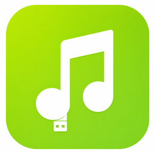
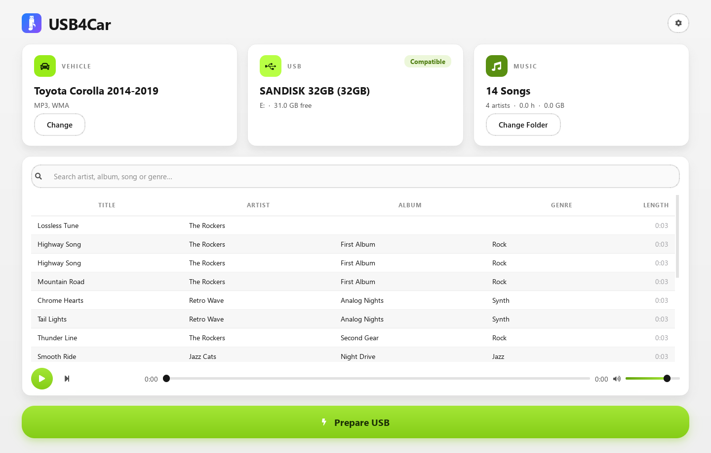
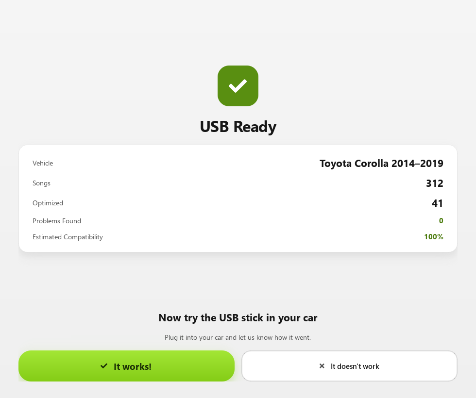
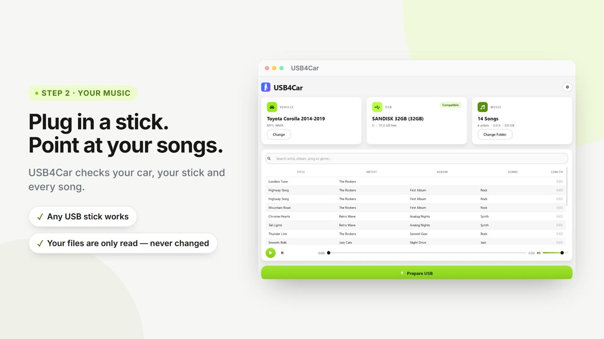

  

<h1 align="center">USB4Car — Make Any USB Stick Play Your Music in the Car</h1>

  <a href="https://usb4car.com"><b>Website</b></a> ·
  <a href="https://usb4car.com/download"><b>Free Trial (Windows)</b></a> ·
  <a href="https://usb4car.com/help"><b>Help & Guides</b></a> ·
  <a href="https://www.youtube.com/watch?v=9meNxf6HQcw"><b>Watch the Demo</b></a>

---

Car radios are picky. Wrong file format, wrong USB format, one odd file name — and your music silently refuses to play. **[USB4Car](https://usb4car.com)** is a Windows app that fixes all of it with one button.

## How it works

1. **Pick your car** — USB4Car knows what 9,000+ car radios can play: formats, folder limits, quirks.
2. **Plug in any USB stick** — it's checked instantly and prepared exactly how your radio expects it (FAT32, MBR, the works — handled for you).
3. **Press one button** — songs your radio can't play are converted, duplicates removed, broken files skipped, missing titles repaired, and everything is verified before you leave the house.

## Why people use it

- **No technical knowledge needed** — plain language, in 7 languages, never a cryptic error
- **Your music library is only read, never changed** — only the USB stick is written to
- **Works offline** once installed
- **Pay once, use forever** — $19.99 one-time, no subscription, no account, unlimited USB sticks, up to 3 computers
- **Free trial with no time limit** — everything except the final "Prepare USB" step, so you see exactly what it would fix first: [usb4car.com/download](https://usb4car.com/download)

## Fix your problem right now (free guides, no app needed)

These guides lead with the answer:

| Problem | Guide |
| --- | --- |
| USB stick not recognized at all | [USB not recognized in car](https://usb4car.com/problems/usb-not-recognized-in-car) |
| Which format actually works | [Best USB format for car music](https://usb4car.com/problems/best-usb-format-for-car-music) |
| Radio shows only some songs | [Car only shows some songs](https://usb4car.com/problems/car-only-shows-some-songs) |
| Songs play in the wrong order | [Songs play in wrong order](https://usb4car.com/problems/songs-play-in-wrong-order) |
| "No compatible files" error | [No compatible music files found](https://usb4car.com/problems/no-compatible-music-files-found) |

Car-specific guides: [Toyota](https://usb4car.com/toyota/) · [Volkswagen](https://usb4car.com/volkswagen/) · [Honda](https://usb4car.com/honda/) · [Ford](https://usb4car.com/ford/) · [BMW](https://usb4car.com/bmw/) · [Hyundai](https://usb4car.com/hyundai/) — or browse [all guides](https://usb4car.com/help).

## See it in action

75 seconds, start to finish: [watch on YouTube](https://www.youtube.com/watch?v=9meNxf6HQcw) or on [usb4car.com](https://usb4car.com/#video).

## FAQ

**Is this open source?**
No — this repository hosts product information only. The app is a commercial Windows application built with Python/PySide6 and FFmpeg under the hood.

**Does it work with my car?**
Almost certainly. Check your car in two seconds on [usb4car.com](https://usb4car.com/#cars) — and if your model isn't listed, the universal profile is tuned to work with nearly every radio that has a USB slot.

**What does it cost?**
[$19.99 one-time](https://usb4car.com/buy). Free updates for a year, yours forever, 14-day money-back guarantee.

**I need help.**
[Contact us](https://usb4car.com/contact) — you'll get a reply from the people who build the app within one business day.

---

  <a href="https://usb4car.com">usb4car.com</a> · © 2026 USB4Car · Pay once, keep it forever

